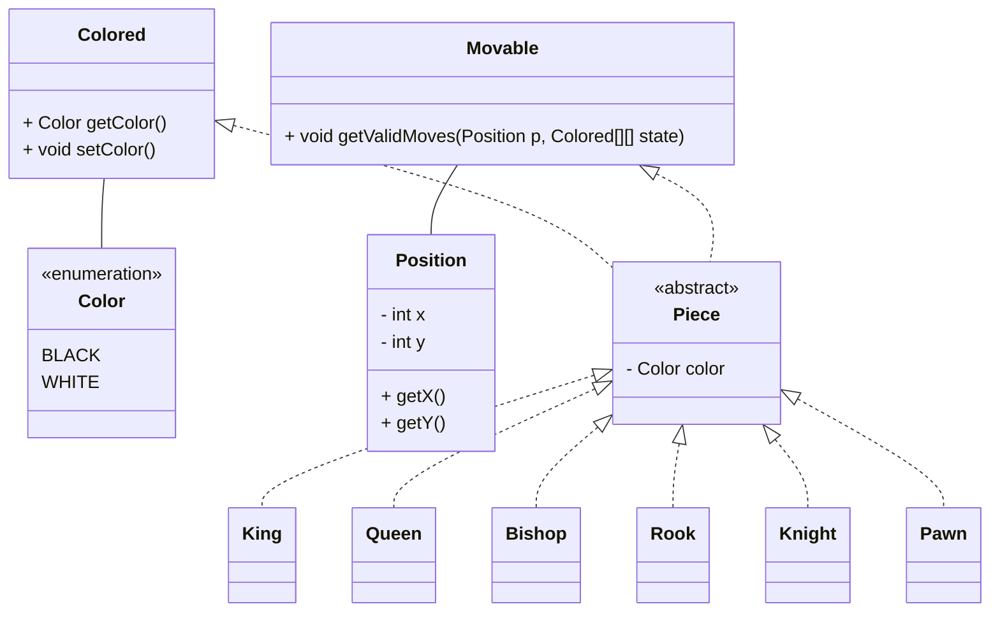

# lp2-chess
Chess implementation in Java submitted as final assignment for the Programming Languages II class at [IMD](imd.ufrn.br)/[UFRN](ufrn.br)

## Initial Class Diagram

```mermaid
classDiagram

    class Color {<<enumeration>>}
    Color : BLACK
    Color : WHITE

    Colored : + Color getColor()
    Colored : + void setColor()

    Position : - int x
    Position : - int y
    Position : + getX()
    Position : + getY()

    Movable : + void getValidMoves(Position p, Colored[][] state)
    
    class Piece {<<abstract>>}
    Piece : - Color color

    Colored <|.. Piece
    Movable <|.. Piece


    Piece <|.. King
    Piece <|.. Queen
    Piece <|.. Bishop
    Piece <|.. Rook
    Piece <|.. Knight
    Piece <|.. Pawn

    Movable -- Position
    Colored -- Color
```
